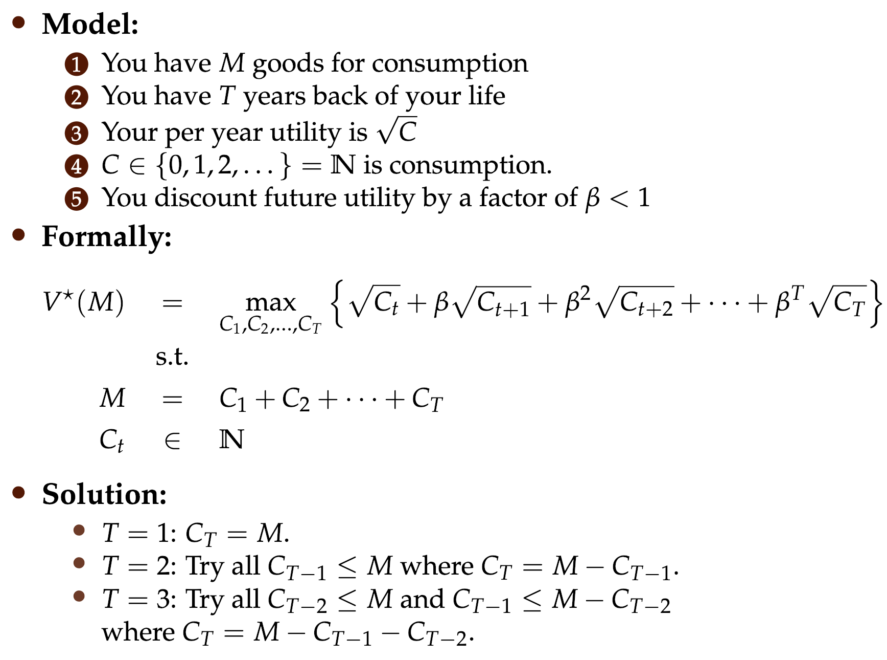
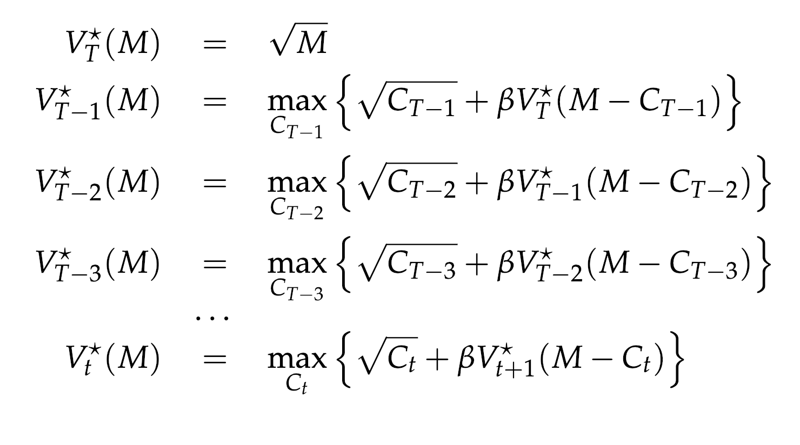
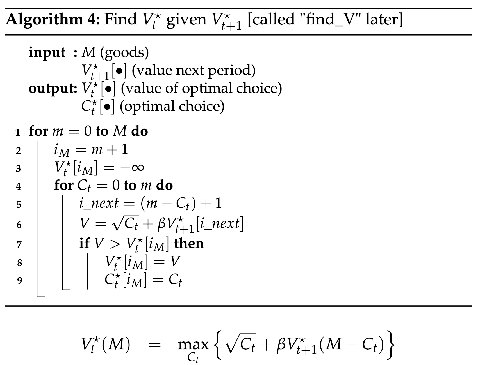
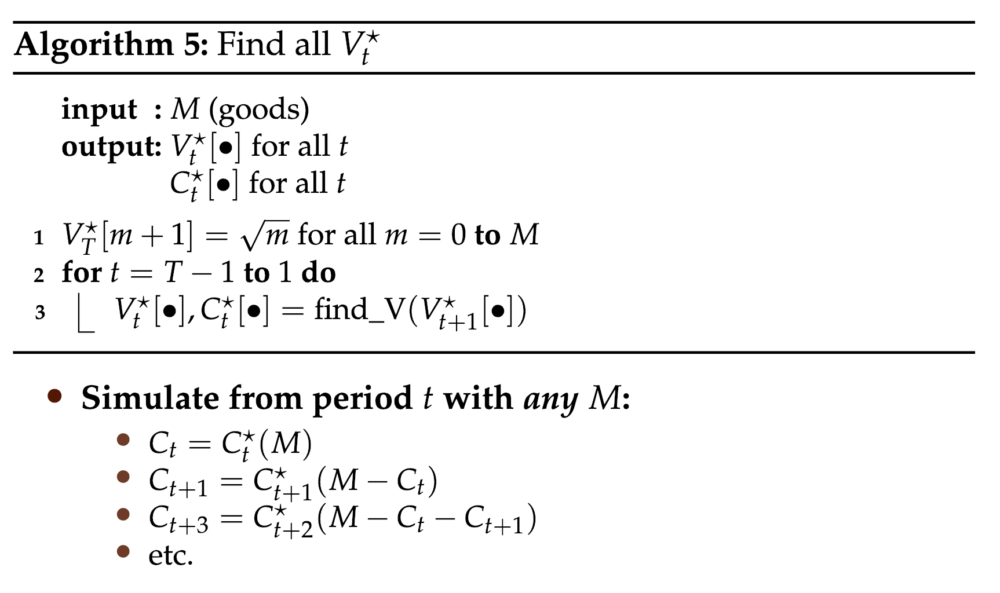

# Introduction

Mulitple algorithms proposed for solution

### Backwards Induction

Solving the problem by iteratively solving some subset, through recursion:

Illustrated as:

The concept of maximization of $V_{T-2}$, by maximizing $V_{t-1}$ and so on and so forth.

Two important algorithms:

Important concepts are:

- States (number of goods $M_t$)
- Choices (Consumption $C_t$)
- Payoff function (utility , $\sqrt{C_t}$)
- Transition function (next periods states)
- Value function = Value today (${V}^{optimal}_{t}({M}_{t})$)
- Continuation value (Value after today)
- Policy function (OPtimal choice)
