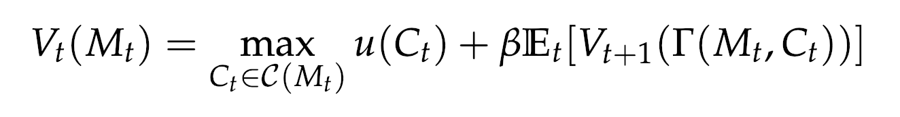
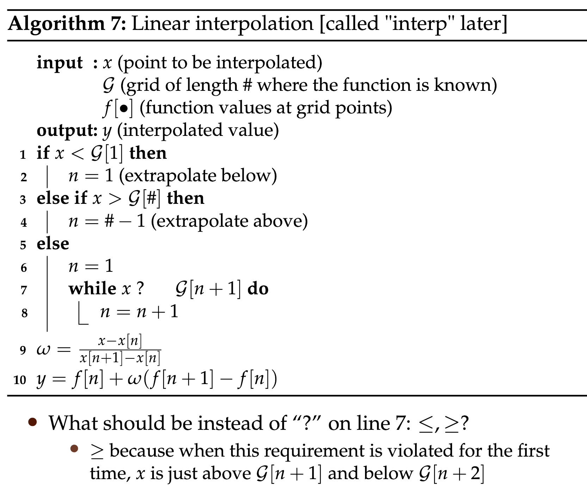
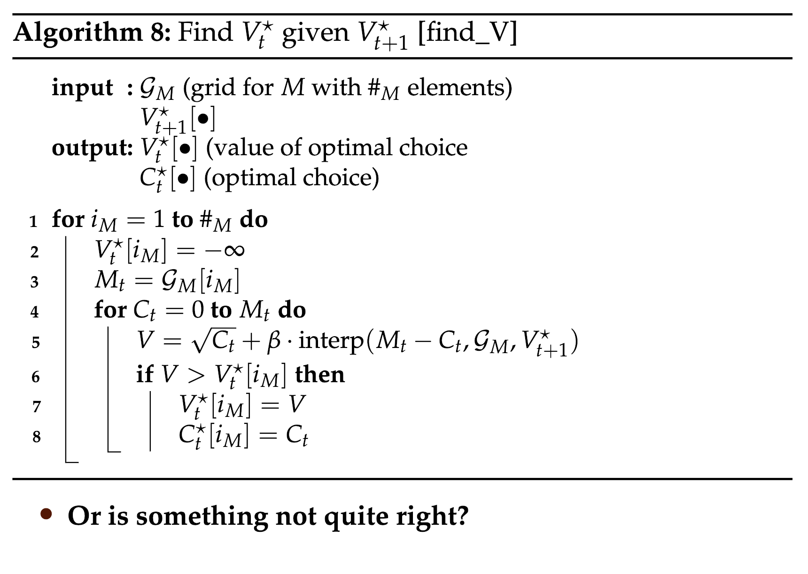
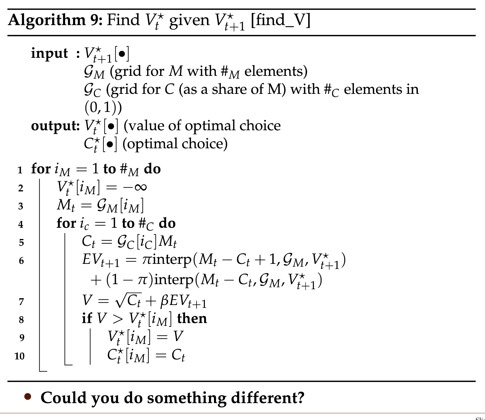

# The Bellman Equation

Questions:

- After reformulation, is $M$ then a state variable? or does it still denote the number of goods possible for consumption throughout the period.

In general notation:

### Principle of Optimality

Whatever the initial conditions (initial state and decision), the following decision must constitute an optimal policy with regard to the state following the first decision

### Important algorithms

