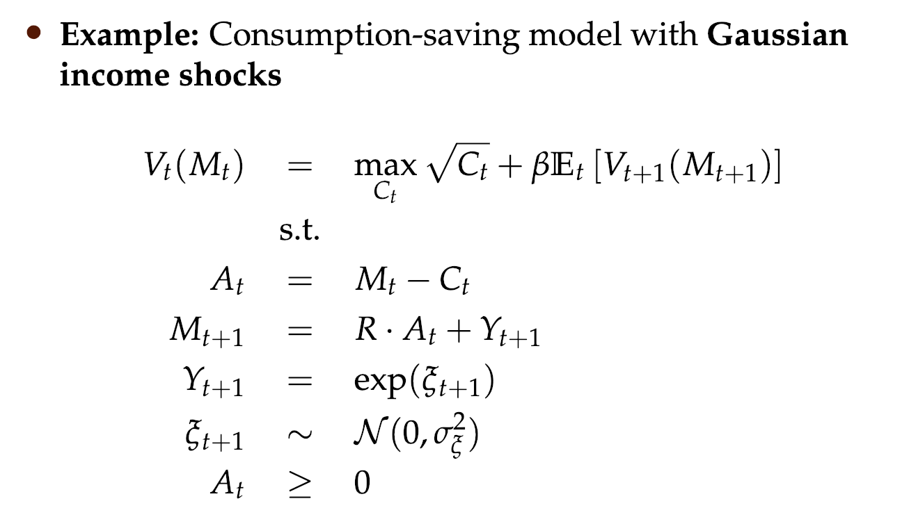
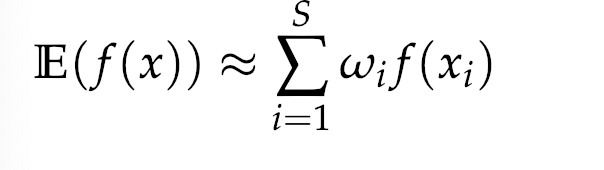
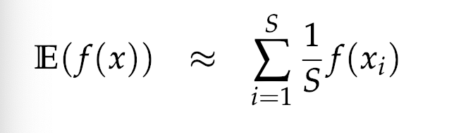
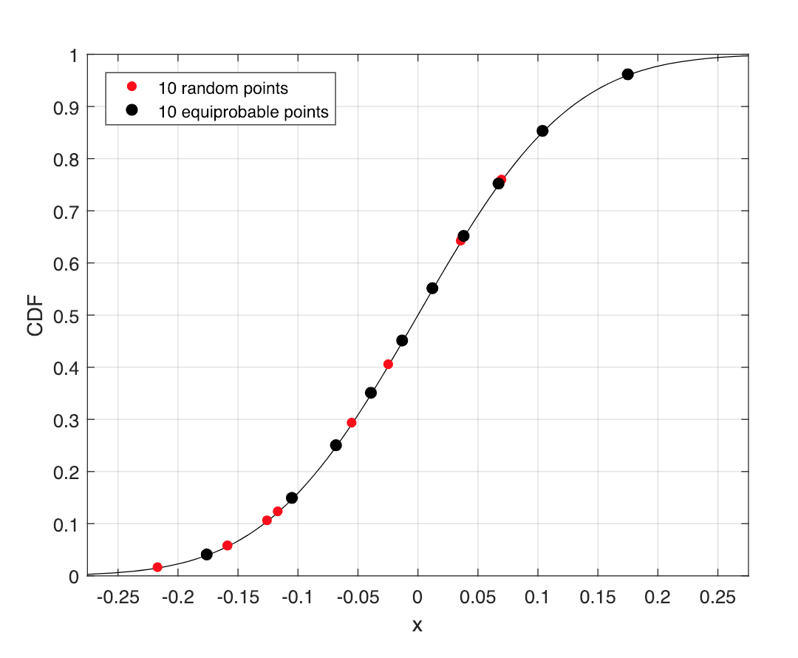
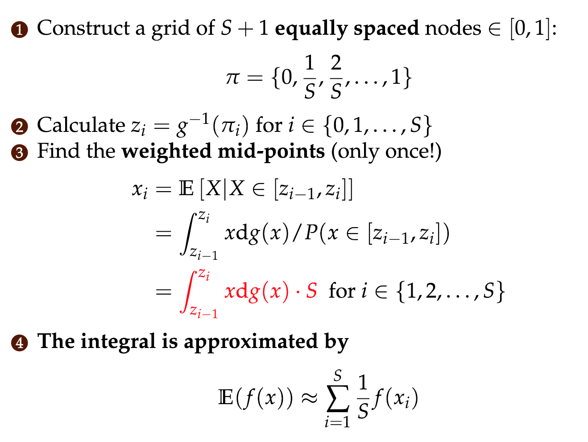
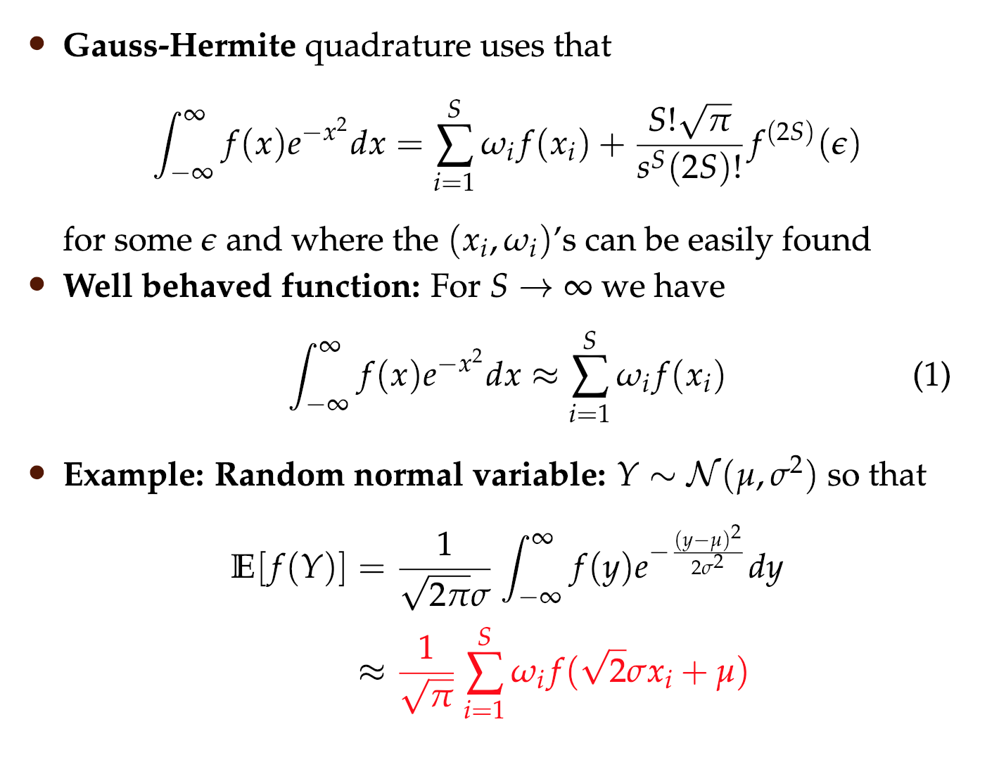
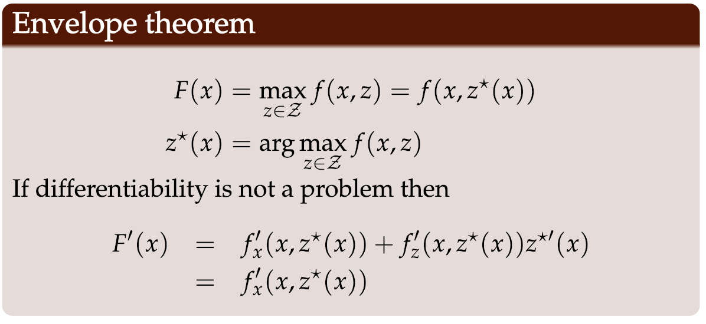
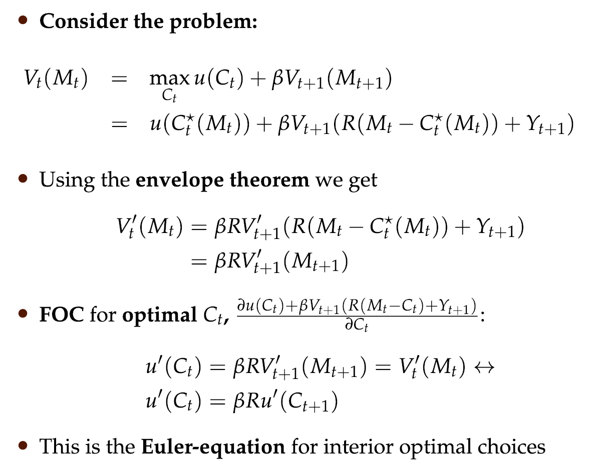
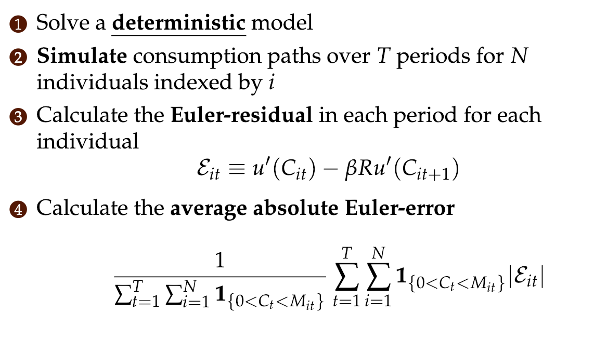

# Numerical Integration + Simulation

### Simulation

- We find that it's hard to evaluate the model's expectation.
- Taking expectation requires solving af integral. This can be infeasible (f.x. normal distribution don't have a closed form solution for a CDF).
- Solve the problem as a discrete sum:
- 
- There exists 4 possible solutions:
    - Monte Carlo Integration
    - Equiprobable Integration
    - Gaussian quadrature (Usually this is the best way)
    - Discretization

### Montecarlo integration

- Draw random $S$ numbers $x_i$ from som CDF.
- Calculate: 

### Equiprobable points

Construct equally spaced bins. Do montecarlo integration within each bin and use the weight (ie. The probability of being in given bin), to calculate the Expectation.

### Gaussian Quadrature

> __There are formulas__ for the sequences of $x_i$ and $\omega_i$ for __exact__ integration of certain polynomials

The formula:

__Look at algorithm 10 for implementation of model__

### Euler Equation

Assume we not to optimize to functions, where one takes the output of the other: $y=f(x)$ and $z = g(x, y)$. This can be solved with the envelope theorem.

Using this we can find the optimal relationship between two periods:

This is the same as the Ramsey Model in Macro 3.

### The euler residual

A measure of the model (how much the stochastic part obscures the result compared to an un-deterministic model).
