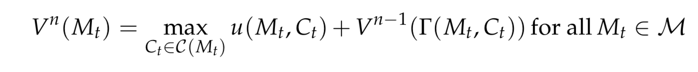
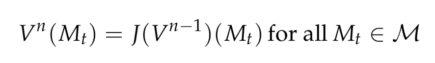
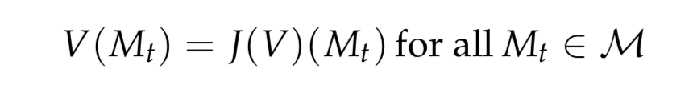
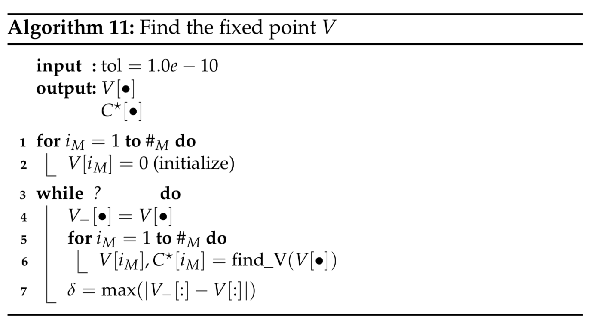

# The Bellman Operator

### The Bellmann Operator

We have seen the Bellmann equation. This can alternatively be written as an operator:

Equation: 

Bellman Operator: 

This can have a fixed point: 

Where $V$ is an function.

This is only true if certain requirments is met:
- Monotone function
- Continous
- Discounted
### Value function Iteration

The solution is almost the same as with finite time horizon. Just with __very__ large $T$.

### Policy Iteration

Unclear what to do?

### Projection Methods

- Guess and verify
    - Make a qualified quess of an solution. Verify if this quess holds up.
    - Only use for certain models
