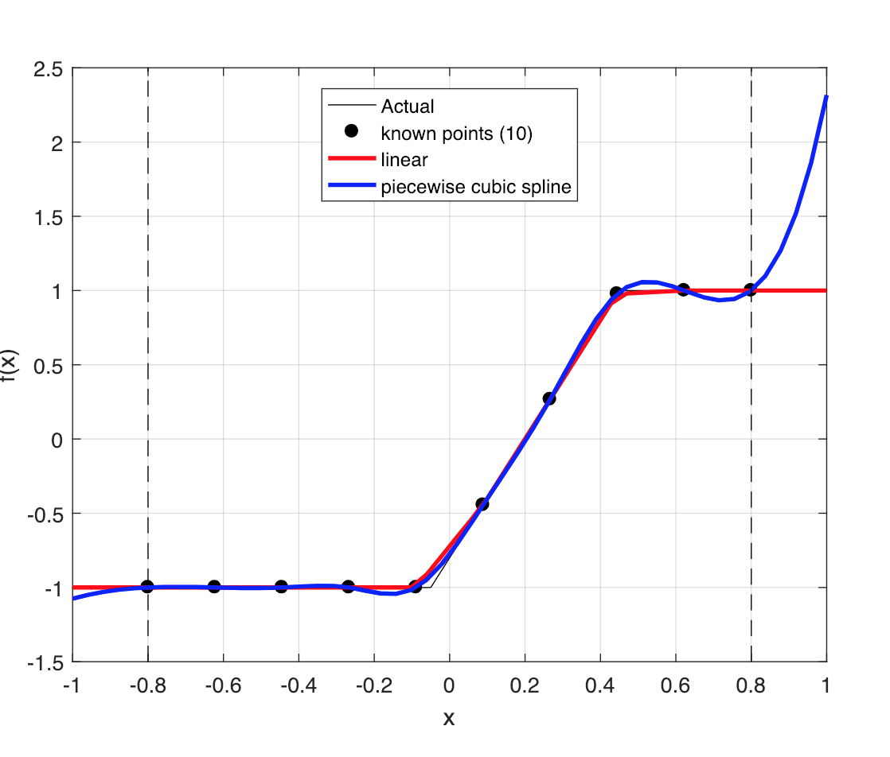

# Function Appoximation and Curse of Dimensionality

### Interpolation

There existst other methods of interpolation, than those covered in lecture 4: _Piecewise Splines_ and _B-splines_

Linear and cubic splines:

Cubic splines are more flexible that regular piecewise interpolation. Also differentiable. Unfortunately is slower.

HELP : Shape perserving

B-splines (unclear description)

Chebyshew (unclear description)

### The curse of dimensionality

DOnt understand slides.

### Programming
