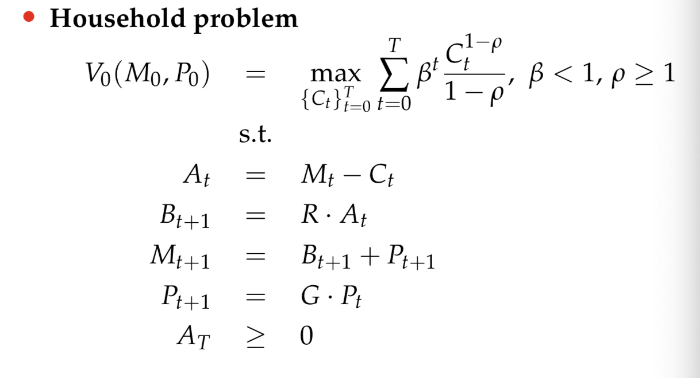
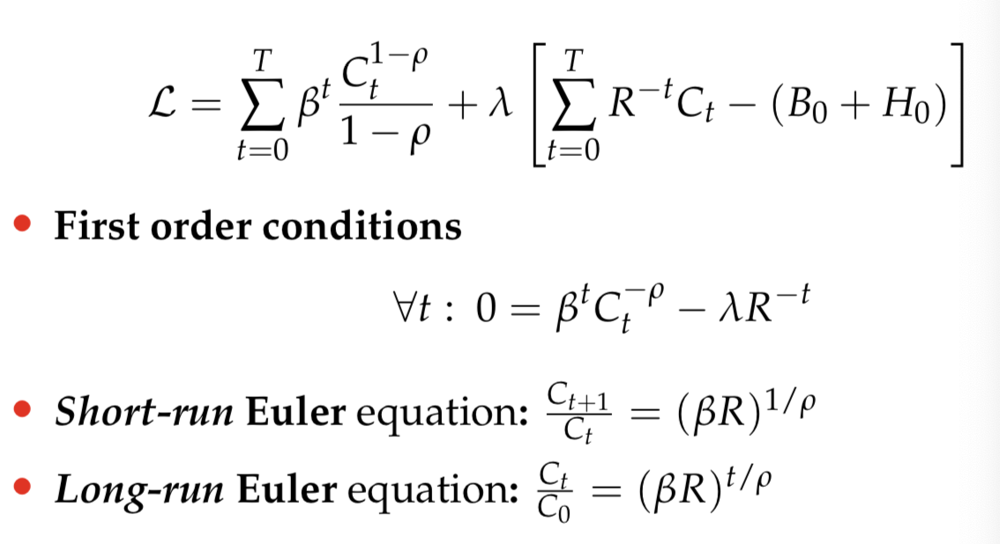
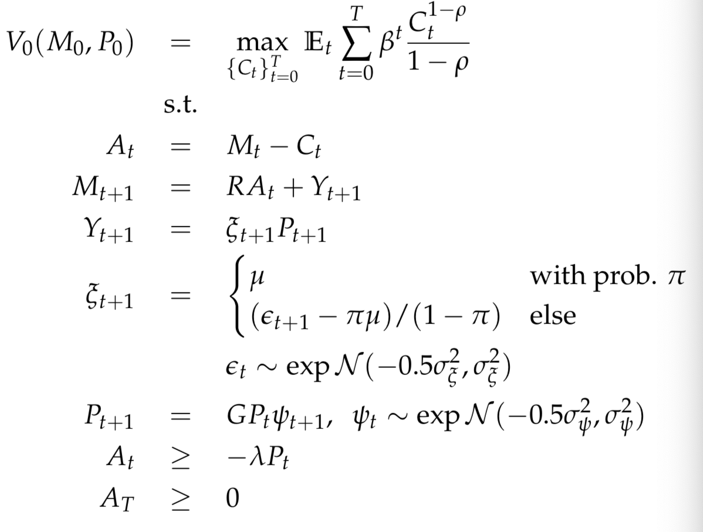
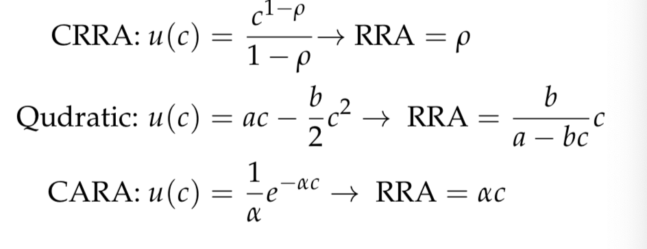
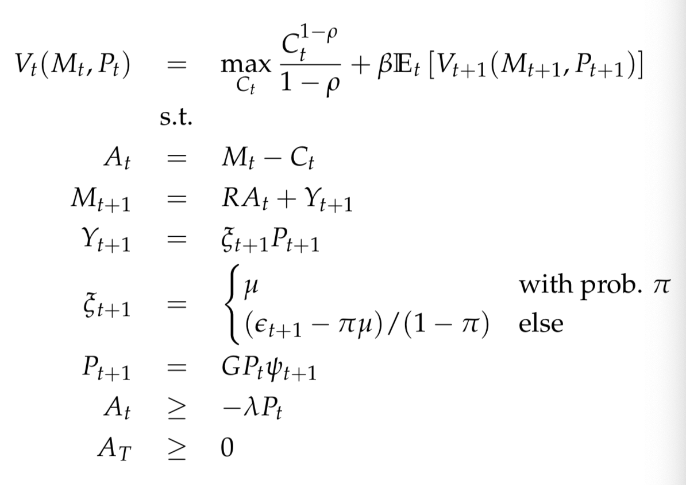
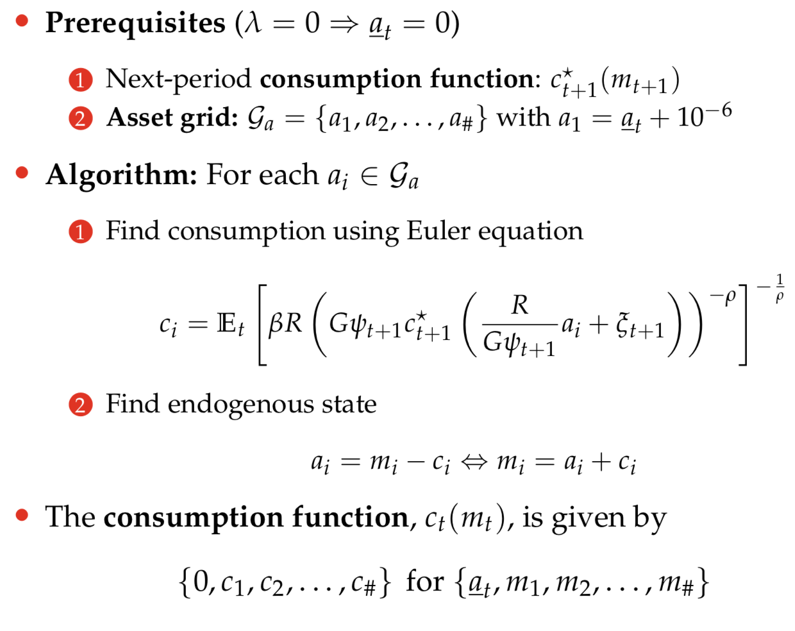

# Buffer Stock Model

### Consumption/Saving relationship

- This is what is investigated the next to lectures.

### Permanent Income Hypothesis

Q: what is $P_t$ and $G$ ? Is it growth and prices?

- Assumes wealth in period $T$ is 0.
- This leads to an lagrangian problem:
- Results in: 

### Buffer Stock Model

- Fully dynamic problem (cannot be solved through lagrangian)
- No analytical solution (unless certain reuirements)
    - CRRA (Constant Relative Risk Aversion) preferences -> No analytical solution
    - CARA (constant relative risk aversion) preferences -> Some analytical results, however implausible properties
    - Also quadratic.
    - Overview of utility functions:
    - 
- Can be solved by setting up the bellman equation and use the tools of dynamic programming.
- 

Q: How to interpret the Buffer Stock target?

Lifecycle
- We can introduce demographics as an exogenous variable

### Endogenous Grid Method (EGM)

- Define that: $A = M - C \implies M = C + A$ (in time $t$).
- We can map out the consumption function without using any numerical solver.
- Algorithm:

Paper topic

### Further Perspectives
